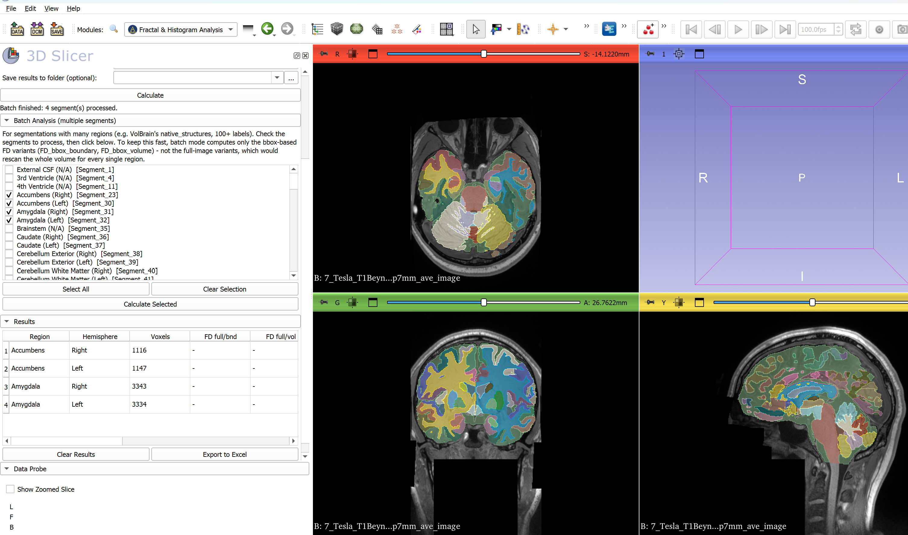

# SlicerFractalHistogramAnalysis

3D Slicer extension that computes the 3D box-counting fractal dimension and
intensity histogram statistics of a segmented brain structure **directly
inside Slicer** - no manual "export to .nii, then run a script" step.

This is the Slicer-integrated version of the standalone CLI tool:
[brain-fractal-histogram-analysis](https://github.com/niyaziacer/brain-fractal-histogram-analysis).
Both share the exact same, independently validated math (`fractal_histogram_core.py`
is copied from the CLI repo); this extension just removes the file-export step
by reading the segment straight out of Slicer's Segmentation node.

## What it computes

For a selected segment:

- **Fractal dimension** (4 variants, same methodology as the CLI tool):
  `FD_full_boundary`, `FD_full_volume`, `FD_bbox_boundary`, and
  **`FD_bbox_volume` (recommended)** - see the CLI repo's README for why all
  four are computed and which one to report.
- **Intensity histogram statistics** (optional, if a T1/reference volume is
  selected): mean, std, min, max, skewness, kurtosis of the voxel intensities
  inside the segment.

## Installation

### Option 1: Extension Manager
Not yet submitted to the Slicer Extensions Index (planned once this is
tested end-to-end). For now, use manual installation below.

### Option 2: Manual installation (for testing)
1. Download or clone this repository.
2. In 3D Slicer: **Edit → Application Settings → Modules**, click **Add**
   under "Additional module paths", and select the
   `SlicerFractalHistogramAnalysis/FractalHistogramAnalysis` folder (the
   inner folder that directly contains `FractalHistogramAnalysis.py`).
3. Click **OK** and restart Slicer.
4. Find the module: **Modules → Quantification → Fractal & Histogram Analysis**.

## Usage

### Single segment (all 4 FD variants)
1. Segment the structure(s) of interest (e.g. via the VolBrain extension +
   Segment Editor, or import an existing `.nii` labelmap as a segmentation).
2. Open the **Fractal & Histogram Analysis** module.
3. Select the **Segmentation** node and the **Segment** to analyze.
4. Optionally select a **T1 volume** to also compute histogram statistics.
5. Optionally set an **output folder** to save results to CSV (same schema
   as the CLI tool: `fractal_results_comparison.csv` /
   `roi_histogram_stats.csv`) and PNG comparison/histogram plots.
6. Click **Calculate**. Repeat for each segment/structure - results
   accumulate in the table.

### Batch analysis (many segments at once)
If your Segmentation node has many regions (e.g. VolBrain's
`native_structures*.nii.gz`, which has 100+ labels), open the **Batch
Analysis** section, check the segments you want, and click **Calculate
Selected**. To keep this fast, batch mode computes only the bbox-based FD
variants (`FD_bbox_boundary`, `FD_bbox_volume`) - not the full-image
variants, which would rescan the whole volume for every single region.

### Automatic structure names (volBrain and OpenMAP-T1)
When a multi-label parcellation volume is imported into Slicer without a
color table, Slicer names each segment `Segment_<N>`, where `N` is the
original integer label value (e.g. `Segment_47`). This extension can
resolve that back to the real structure name and hemisphere - but which
table to use must be picked explicitly with the **Label scheme** dropdown:

- **volBrain (native_structures)**: volBrain's own label table (e.g.
  `Segment_47` -> "Hippocampus (Right)").
- **OpenMAP-T1 (Type1 Level5, 280 regions)**: OpenMAP-T1's JHU-atlas-based
  Type1 Level5 table (e.g. `Segment_75` -> "Hippo (Left)"). Also directly
  recognizes segments already renamed to their abbreviation (e.g. `Hippo_L`,
  `SFG_PFC_R`), which is what pipelines like
  [SlicerOpenMAPT1Auto](https://github.com/niyaziacer/SlicerOpenMAPT1Auto)
  produce.
- **Auto (filename-based only)**: skips label-table lookup entirely and
  only parses generic filename patterns (e.g. `right_amygdala.nii`) - use
  this for the CLI tool's manual one-file-per-region workflow.

**This choice matters and is never auto-detected**: both volBrain and
OpenMAP-T1 name raw imported segments `Segment_<N>`, but the same number N
means a completely different region in each scheme (e.g. N=47 is "Right
Hippocampus" in volBrain but the left entorhinal area in OpenMAP-T1) -
picking the wrong scheme silently mislabels every region.

### Exporting results
- **Save results to folder**: appends every Calculate/batch run to
  persistent CSV files (`fractal_results_comparison.csv` /
  `roi_histogram_stats.csv`) and saves PNG plots, in the same format as the
  CLI tool.
- **Export to Excel**: saves whatever is currently in the on-screen Results
  table as a `.xls` file (HTML-table format - opens directly in Excel or
  LibreOffice, no extra Python packages required). Use **Clear Results**
  first if you want a clean export of just the latest run.

## Requirements

- 3D Slicer 5.0+
- NumPy (bundled with Slicer)
- matplotlib (only needed if saving plots to an output folder; the module
  will offer to install it automatically the first time it's needed)

## Developer

Prof. Dr. Niyazi Acer (Retired, Erciyes University)

## License

MIT - see [LICENSE](LICENSE).
